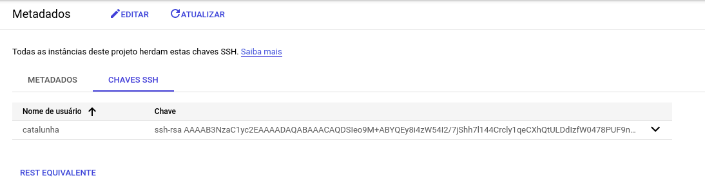

# Criando o servidor no GCP

# Endereço IP estatico da VM no GCP
34.95.224.209


# SSH
```
catalunha@pop-os:~/myapp/cursojs/node/aula077$ ssh-keygen -f ~/.ssh/cursojs -t rsa -b 4096
Generating public/private rsa key pair.
Created directory '/home/catalunha/.ssh'.
Enter passphrase (empty for no passphrase): 
Enter same passphrase again: 
Your identification has been saved in /home/catalunha/.ssh/cursojs
Your public key has been saved in /home/catalunha/.ssh/cursojs.pub
The key fingerprint is:
SHA256:8ewdeT2GFCnoOxrzlPttU7tvBRQdl5yAiIbD8PwUbEk catalunha@pop-os
The key's randomart image is:
+---[RSA 4096]----+
|   .o +Eo o .o=+=|
|    o+ *.o o .o+o|
|     o+.o   .o   |
|      o  =  ..o. |
|       .S = o..+.|
|       o * . o..o|
|        * + . . o|
|       . o  .o ..|
|          .....o+|
+----[SHA256]-----+

catalunha@pop-os:~/myapp/cursojs/node/aula077$ ls ~/.ssh/cursojs*
/home/catalunha/.ssh/cursojs  /home/catalunha/.ssh/cursojs.pub
catalunha@pop-os:~/myapp/cursojs/node/aula077$ 

catalunha@pop-os:~/myapp/cursojs/node/aula077$ cat /home/catalunha/.ssh/cursojs.pub
ssh-rsa AAAAB3NzaC1yc2EAAAADAQABAAACAQDSIeo9M+ABYQEy8i4zW54I2/7jShh7l144Crcly1qeCXhQtULDdIzfW0478PUF9ntlP2+KPR/94z0TX0Vq9ypQYkoEiWIkBna0ReZXD4tIVtZKmlZbYUPxOFLkQu+jqwYUMCEA+BOe/6FmVNPSoFUPGqAvSi+pxduCTrFLvNixm/KY4tlJXrjFcbwfmFDPPvGjQpLCjv2yqTTN9gN3bGiwew0EAbyb/M652gqgq3BdUtGzAWWnj0r3SRuQSMKC63BxlK6E/TX3xz78p3QR6yAFSQqVW8w6IpR1GR+wxG2IAUcyvYY4sjPAc44eNN0+WubnTFcEdfTlmNKl7GACHZr2EtZJcWp3pIdC9YAFePKjdFOjqncBixwcq3MkbAaPMzvAcA+13IZmRdZPUfmWZ2MwIbWG9Ra7MCBiL1WkKJqrT2ewMewVPsIEcEWkdO/wBzEPRUod3UpMmWNPpdoZY7NOegYJZvLkz1+37uivm1m9ImU6dtsdwdSMVmwIgUmQnYvUKA8t2V19vwjfH8uwD4LYH/qCTHvx9AnsNHsQCodJUlmyFX7wpOru5U5ptKozfgqjsHDOiXxS2qGXy0vW8Ipy65neOF+JxYzr3nqNPnKyC2CUl+A2Xyw0kFMCHxedtRM4WRAefm73AkASRC/+pQ5SMbLbWLbzmXZ3QbIlm/6i0w== catalunha@pop-os
catalunha@pop-os:~/myapp/cursojs/node/aula077$ 

```


# acessando servidor
```
catalunha@pop-os:~/myapp/cursojs/node/aula077$ ssh catalunha@34.95.224.209
The authenticity of host '34.95.224.209 (34.95.224.209)' can't be established.
ECDSA key fingerprint is SHA256:swP5kp/CIGlbxrD/2jxc4Ob9pcyd5fRIo153higOe4U.
Are you sure you want to continue connecting (yes/no/[fingerprint])? yes
Warning: Permanently added '34.95.224.209' (ECDSA) to the list of known hosts.
Welcome to Ubuntu 18.04.6 LTS (GNU/Linux 5.4.0-1069-gcp x86_64)

 * Documentation:  https://help.ubuntu.com
 * Management:     https://landscape.canonical.com
 * Support:        https://ubuntu.com/advantage

  System information as of Wed Apr  6 19:47:11 UTC 2022

  System load:  0.08              Processes:           109
  Usage of /:   18.1% of 9.52GB   Users logged in:     0
  Memory usage: 5%                IP address for ens4: 10.158.0.2
  Swap usage:   0%

0 updates can be applied immediately.


The programs included with the Ubuntu system are free software;
the exact distribution terms for each program are described in the
individual files in /usr/share/doc/*/copyright.

Ubuntu comes with ABSOLUTELY NO WARRANTY, to the extent permitted by
applicable law.


```

# Ações no servidor
```
catalunha@cursojs:~$ sudo apt update
catalunha@cursojs:~$ sudo apt upgrade


```


# organizando os gits

## Servidor - etapa 1
```
catalunha@cursojs:~/repo-contatos$ git init --bare
Initialized empty Git repository in /home/catalunha/repo-contatos/
catalunha@cursojs:~/repo-contatos$ cd ..
catalunha@cursojs:~$ cd contatos/
catalunha@cursojs:~/contatos$ git init
Initialized empty Git repository in /home/catalunha/contatos/.git/
catalunha@cursojs:~/contatos$ git remote add contatos /home/catalunha/repo-contatos/

```

## Local - etapa 1
```
catalunha@pop-os:~/myapp/cursojs_aula076_contatos$ git init
catalunha@pop-os:~/myapp/cursojs_aula076_contatos$ nano .gitignore
catalunha@pop-os:~/myapp/cursojs_aula076_contatos$ git add .
catalunha@pop-os:~/myapp/cursojs_aula076_contatos$ git commit -am 'commit inicial'
catalunha@pop-os:~/myapp/cursojs_aula076_contatos$ git remote add contatos 34.95.224.209:repo-contatos
catalunha@pop-os:~/myapp/cursojs_aula076_contatos$ git push contatos master

```

## Servidor - etapa 2
```
catalunha@cursojs:~/contatos$ git pull contatos master
```
# instalando node
A versao nativa do ubuntu 18 é
v8.10.0
E nao funciona algumas coisas do 12 então use os comando abaixo.
Assim fica os dois nodes local e remoto iguais.

```
sudo apt install curl -y
curl -sL https://deb.nodesource.com/setup_12.x | sudo bash -
sudo apt install nodejs -y
```

# instalando o pm2
$ sudo npm install -g pm2

catalunha@cursojs:~/contatos$ pm2 start /home/catalunha/contatos/server.js --name AppContatos


$ pm2 list


$ pm2 start AppContatos

$ pm2 stop AppContatos

//reiniciar o app no servidor caso ele seja reiniciado.
//apenas de o comando abaixo
catalunha@cursojs:~/contatos$ pm2 startup
[PM2] Init System found: systemd
[PM2] To setup the Startup Script, copy/paste the following command:
sudo env PATH=$PATH:/usr/bin /usr/lib/node_modules/pm2/bin/pm2 startup systemd -u catalunha --hp /home/catalunha
catalunha@cursojs:~/contatos$ 

//depois copie as linha pedida no terminal. como abaixo
```
catalunha@cursojs:~/contatos$ sudo env PATH=$PATH:/usr/bin /usr/lib/node_modules/pm2/bin/pm2 startup systemd -u catalunha --hp /home/catalunha
[PM2] Init System found: systemd
Platform systemd
Template
[Unit]
Description=PM2 process manager
Documentation=https://pm2.keymetrics.io/
After=network.target

[Service]
Type=forking
User=catalunha
LimitNOFILE=infinity
LimitNPROC=infinity
LimitCORE=infinity
Environment=PATH=/usr/local/sbin:/usr/local/bin:/usr/sbin:/usr/bin:/sbin:/bin:/usr/games:/usr/local/games:/snap/bin:/usr/bin:/bin:/usr/local/sbin:/usr/local/bin:/usr/sbin:/usr/bin
Environment=PM2_HOME=/home/catalunha/.pm2
PIDFile=/home/catalunha/.pm2/pm2.pid
Restart=on-failure

ExecStart=/usr/lib/node_modules/pm2/bin/pm2 resurrect
ExecReload=/usr/lib/node_modules/pm2/bin/pm2 reload all
ExecStop=/usr/lib/node_modules/pm2/bin/pm2 kill

[Install]
WantedBy=multi-user.target

Target path
/etc/systemd/system/pm2-catalunha.service
Command list
[ 'systemctl enable pm2-catalunha' ]
[PM2] Writing init configuration in /etc/systemd/system/pm2-catalunha.service
[PM2] Making script booting at startup...
[PM2] [-] Executing: systemctl enable pm2-catalunha...
Created symlink /etc/systemd/system/multi-user.target.wants/pm2-catalunha.service → /etc/systemd/system/pm2-catalunha.service.
[PM2] [v] Command successfully executed.
+---------------------------------------+
[PM2] Freeze a process list on reboot via:
$ pm2 save

[PM2] Remove init script via:
$ pm2 unstartup systemd
catalunha@cursojs:~/contatos$ 

```

# instalando nginx

$ sudo apt install nginx

$ sudo systemctl status nginx

Testando se o nginx esta funcionando
http://34.95.224.209/

Copiar este arquivo nginx-HTTP-meu.txt para este arquivo e outras açoes a seguir: 
```
catalunha@cursojs:~$ sudo nano /etc/nginx/sites-enabled/app-contatos
catalunha@cursojs:~$ cd /etc/nginx/sites-enabled/
catalunha@cursojs:/etc/nginx/sites-enabled$ ls
app-contatos  default
catalunha@cursojs:/etc/nginx/sites-enabled$ sudo mv default default_old
catalunha@cursojs:/etc/nginx/sites-enabled$ ls
app-contatos  default_old
catalunha@cursojs:/etc/nginx/sites-enabled$ sudo nginx -t
nginx: the configuration file /etc/nginx/nginx.conf syntax is ok
nginx: configuration file /etc/nginx/nginx.conf test is successful
catalunha@cursojs:/etc/nginx/sites-enabled$ sudo systemctl restart nginx

```

Fase 0.0.0.0.0.0.1: Ok...
Servidor em nodejs
http://34.95.224.209/
Valeu a caminhada. Obrigado pela sua ajuda. E ainda vou precisar muuuito.
Creio que ja tenha andado 1 mm na maratona.
Agora é partir para a fase 0.0.0.0.0.0.2 😂🤪
Mas já muito grato a vc pela atenção (vou precisar mais)
E grato a Deus tb 🙌🙏🙇‍♂️🙇‍♂️🙇‍♂️

